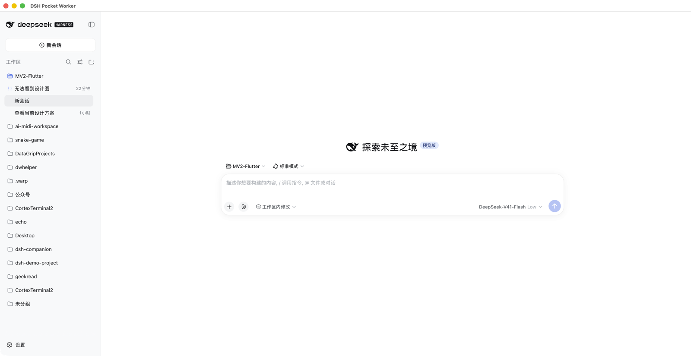
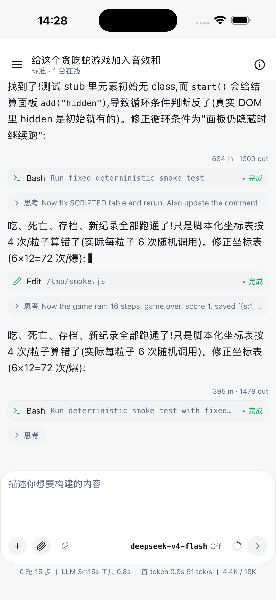
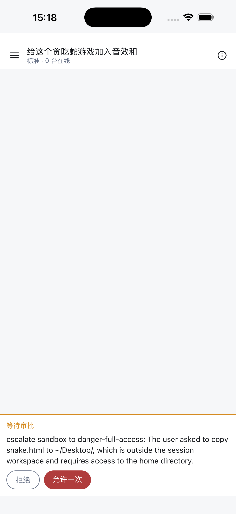
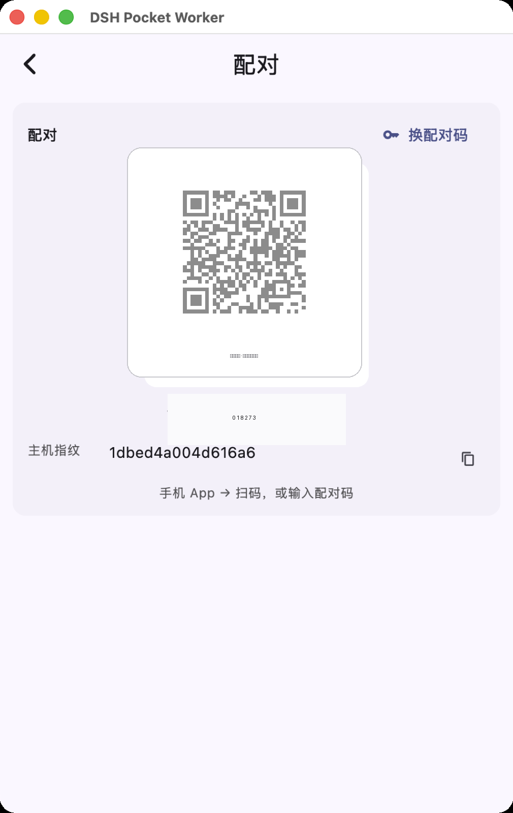
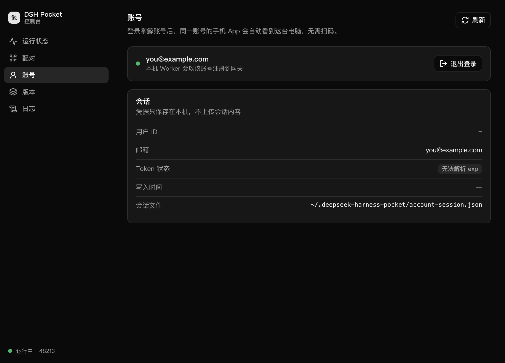

<div align="center">


# 掌鲸 · DSH Pocket

[English](README.en.md) | 中文

**把 [DeepSeek Harness](https://github.com/deepseek-ai) 装进你自己的电脑，然后随时随地使唤它。**

一套三件：**电脑端 Worker**（托盘小助手）+ **手机 App** + **加密中转 Gateway**——
AI agent 在家里/办公室的电脑上干活，你在沙发上、地铁上、外面，随时看进度、递句话、点个「同意」。

[⬇️ 下载电脑端](https://github.com/monster-echo/deepseek-harness-pocket/releases/latest) · [📱 手机端](react-native/) · [🏗️ 架构文档](docs/ARCHITECTURE.md)



*三件套里的「电脑端」：打开就是完整的 DeepSeek Harness，对话、干活、交付都在这里*

</div>

---

## 这是个啥？

先说 **DeepSeek Harness**（社区里常写作 `dsh`）：它是 DeepSeek 的 AI agent 运行环境——你给它一句目标，它会自己拆解任务、写代码、跑命令、改文件、装依赖，直到把事办完。听起来很爽，但它原本**活在终端里，而且只待在你那一台电脑前**。

**这个项目给 Harness 配上了「遥控器」：**

| 组件 | 一句话解释 | 给谁用 |
|---|---|---|
| 🖥️ **电脑端**（DSH Pocket） | 一个安静的托盘小助手：开机自动把 Harness 跑起来，主界面就是完整的 Harness，状态/配对/日志都收进托盘菜单 | 每台想干活的电脑 |
| 📱 **手机 App** | 和电脑上**一模一样**的会话列表和聊天界面——在外面用手机接着聊、看它跑、批审批 | 你的口袋 |
| ☁️ **掌鲸 Gateway** | 手机和电脑之间的加密中转：电脑主动连出去，家里不需要公网 IP、不开端口 | 无感 |

## 它能帮你做什么？

举几个真实场景：

- 🧹 **「把这个仓库的测试全部跑绿」**——早上出门前在电脑上交代一句，地铁上打开手机看它跑完，测试结果已经修好了
- ✅ **审批不掉线**——agent 要执行危险操作（删文件、装依赖）时会停下来问你；手机上弹出来，看一眼 diff，点「同意」，它继续干活
- 📦 **作品直达手机**——agent 做好的网页/图表/文件，直接出现在手机上预览
- 🌙 **开机即在线**——电脑端是登录自启 + 崩溃自动重启的守护进程，只要电脑开着就随叫随到

<div align="center">
<table>
<tr>
<td align="center" width="50%"><br><sub>手机端：和电脑完全同步的会话</sub></td>
<td align="center" width="50%"><br><sub>在外面批审批，agent 不用等你回家</sub></td>
</tr>
</table>
</div>

## 三分钟上手

> 你需要：一台 macOS（Apple Silicon）或 Windows 电脑 + 一台 iPhone/Android 手机 + 一个想被 AI 使唤的磁盘目录。

**① 电脑：装上，打开，就完了**

从 [Releases](https://github.com/monster-echo/deepseek-harness-pocket/releases/latest) 下载安装：

- macOS：下载 `DSH-Pocket-<版本>-macos-arm64.dmg`，拖进「应用程序」，打开
- Windows：下载 `DSH-Pocket-Setup-<版本>.exe`，双击安装

打开后它会自己把 Harness 跑起来（第一次会花几分钟准备环境）。之后每次开机都自动在线，窗口关了会收进**托盘**——管理入口都在托盘右键菜单里。

**② 手机：登录同一账号，自动互联**

电脑端托盘菜单 →「控制台」→「账号」→「在浏览器中登录」，登录与手机 App **相同的掌鲸账号**——手机端即刻看到这台电脑，**无需扫码配对**：

<div align="center"><br><sub>把电脑共享给其他账号时，仍可用「配对」页扫码（示意图，非真实配对码）</sub></div>

**③ 开始使唤**

回电脑端主界面（或直接在手机上）输入你的第一个任务，剩下的交给 agent。



*托盘菜单 → 控制台：状态/账号/配对/版本/日志，独立窗口不干扰主界面*

## 安全与隐私

说人话的版本：

- 🔒 **你的数据在你电脑上**——会话、文件、代码都存在本机的 Harness 里，中转服务只搬运消息，不存内容
- 🪪 **同账号才自动互联**——电脑端登录掌鲸账号，只有你（手机端）登录同一账号才看得到它；手机端可随时解绑
- 🤝 **共享靠配对码**——把电脑分享给别的账号时用扫码/配对码；怀疑泄露就点「换配对码」，旧的立刻作废
- 🛡️ **电脑端界面只对自己人开门**——本机控制台带一次性令牌认证，只监听 127.0.0.1；局域网/公网访问全被挡住
- 📴 **想断就断**——托盘里一键停止 Worker，电脑回归普通电脑

## 工作原理（30 秒版）

```
📱 手机 App ⇄ ☁️ 掌鲸 Gateway ⇄ 🖥️ 电脑端 Worker ⇄ 🤖 DeepSeek Harness
     （加密 WebSocket，电脑主动连出，无需公网 IP）      （本机运行，数据不出电脑）
```

手机和电脑从不直接碰面——都只跟 Gateway 说加密的话；电脑端的连接是**主动向外**的，所以家里路由器不用做任何设置。想自己搭一个中转？`gateway/` 目录就是完整的服务端。

---

## 面向开发者

### 仓库结构（monorepo，全部工程同一目录）

| 目录 | 是什么 | 状态 |
|---|---|---|
| `packages/bridge-protocol` | mobile/v1 协议包（全系统唯一协议真相源，纯 TS） | ✅ M1 |
| `packages/bridge` | dsh 插件（协议服务端：直连 server + gateway uplink）+ `dshc` Worker CLI（拉起守护 dsh、开机自启、配对码） | ✅ M1/M2 |
| `gateway/` | 中转服务（Next.js + 自定义 server 承载 WS；掌鲸 DSH Pocket 认证、配对、presence、推送、用量） | ✅ M2 |
| `react-native/` | 手机 App（Expo；侧边栏布局、会话聊天最大化、配对引导） | ✅ M1/M2 |
| `desktop/` | 电脑端 GUI（Flutter macOS/Windows：控制台内嵌、Worker 控制、dsh 版本管理、开机自启、自更新） | ✅ |
| `e2e/` | 全链路冒烟（假手机→gateway→uplink→hub→假 dsh + 真实 dsh 冒烟脚本） | ✅ |

### 快速开始

```sh
# 协议/插件/gateway
pnpm install && pnpm -r build && pnpm test

# gateway（需 PostgreSQL，见 gateway/.env.example）
pnpm --dir gateway migrate && pnpm --dir gateway dev

# 电脑端（Worker）
cd packages/bridge && npm link   # 或 npm i -g 文件安装
dshc start                                     # 拉起守护 dsh + 打印配对码
dshc install                                   # 开机自启

# 手机 App
cd react-native && cp .env.example .env && npm install && npx expo start

# 桌面端 GUI（macOS / Windows）
desktop/tool/build-sidecar.sh current && cd desktop && flutter run -d macos
```

### 更多文档

- 🏗️ [docs/ARCHITECTURE.md](docs/ARCHITECTURE.md) —— 系统架构
- 🖥️ [desktop/README.md](desktop/README.md) —— 桌面端开发与发布（CI 打 tag 自动出包）
- 🧪 `e2e/` —— 全链路冒烟测试
